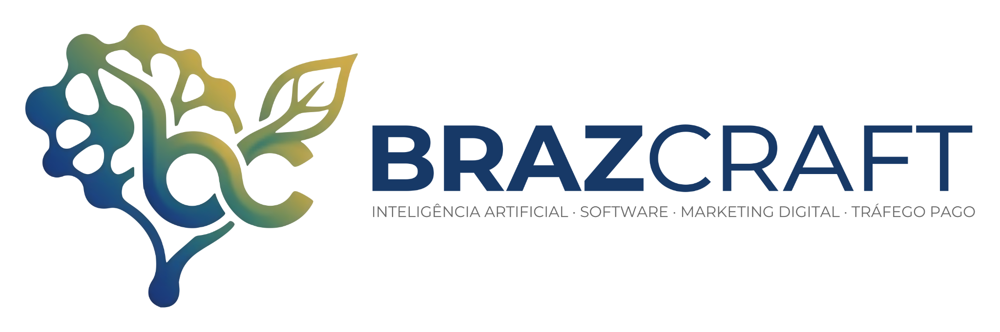
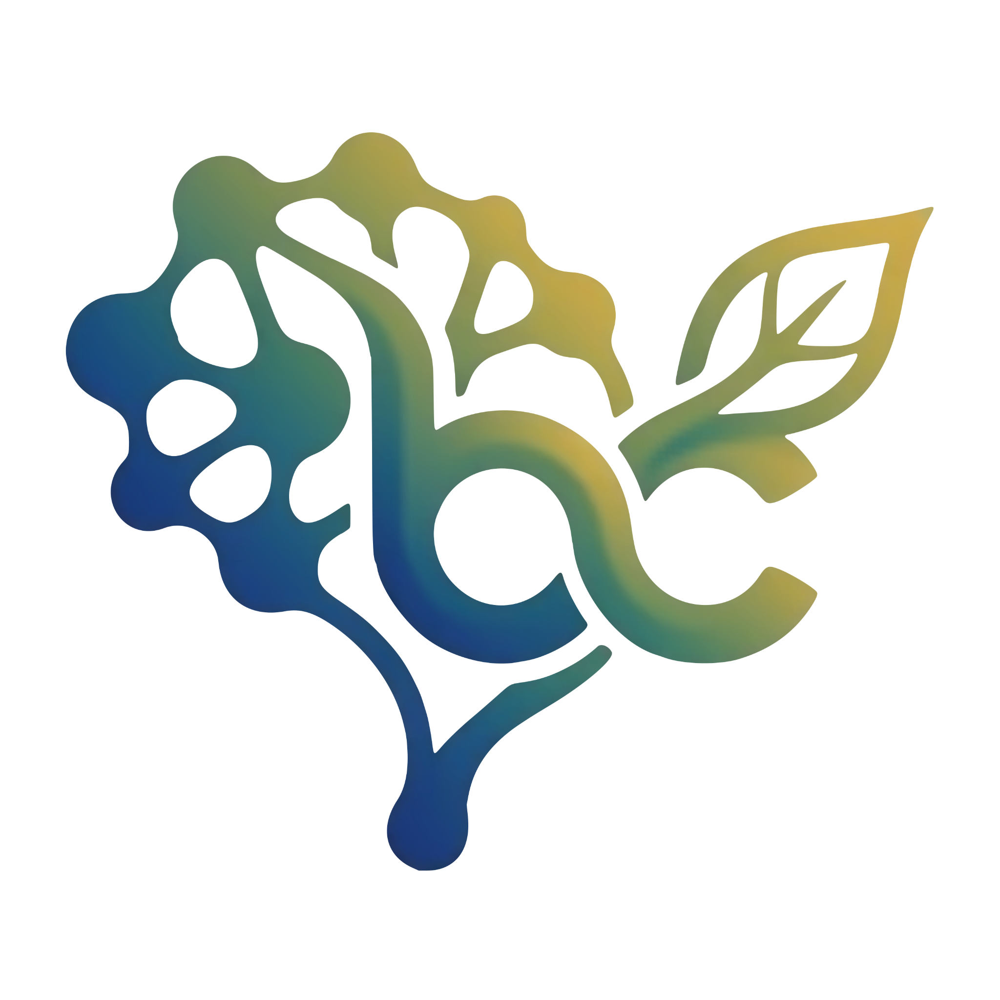

<div align="center">

  

  <br />

  <h3>Raízes humanas. Inteligência que transforma.</h3>
  <p><em>Dar forma à tecnologia que faz sentido para a vida.</em></p>

  <p>
    <a href="https://www.brazcraft.com.br"></a>
    <a href="mailto:brenorubens@icloud.com"></a>
    <a href="https://github.com/brenoruivo-dev"></a>
    
  </p>

  <p>
    📍 <strong>Dublin, Ireland</strong> &nbsp;|&nbsp; <strong>São Paulo, Brazil</strong>
  </p>

</div>

---

### 🌿 Sobre mim

Olá! Sou **Breno Ruivo** (`ElBrenoVisk`), fundador e arquiteto de software na **BRAZCRAFT Tecnologia Inova Simples (I.S.)**.

Com formação e vivência entre **Dublin (Irlanda)** e **São Paulo (Brasil)**, desenvolvo produtos digitais de alta complexidade que unem rigor de engenharia de software, modelos avançados de Inteligência Artificial e compromisso com o impacto humano. Acredito que a tecnologia deve ampliar as capacidades humanas com transparência, responsabilidade e precisão.

---

### 🏛️ O Ecossistema BRAZCRAFT

A **BRAZCRAFT** opera com uma estrutura modular de **Crafts**, onde cada especialidade aprofunda a pesquisa e viabiliza soluções práticas de ponta a ponta:

| Craft | Especialidade & Foco | Aplicação Prática |
| :--- | :--- | :--- |
| 🧠 **NeuralCraft** | Pesquisa Aplicada & Inteligência Artificial | Modelos de linguagem (LLMs), RAG com busca vetorial (`pgvector`), agentes autônomos e rastreabilidade documental. |
| ⚡ **CodeCraft** | Engenharia de Software & Arquitetura | Construção de sistemas distribuídos resilientes, microsserviços, APIs robustas e esteiras de testes rigorosas. |
| ☁️ **OpsCraft** | Cloud, DevOps & Infraestrutura Híbrida | Orquestração com Docker/Portainer, Caddy Server com SSL automático, OCI Always-Free, AWS EC2 e Cloudflare R2. |
| ⚖️ **LexCraft** | Tecnologia para o Setor Jurídico | Soluções em análise de dados processuais, automação e inteligência em contratações públicas (PNCP). |
| 📊 **Gestão & Ops** | Automação Empresarial & Produtividade | Plataformas de gestão ágil de projetos e CRM corporativo com fluxos orientados a dados. |
| 🌐 **WebCraft** | Experiências Digitais & Interfaces Modernas | Design systems elegantes com acessibilidade, alta taxa de conversão e fidelidade à marca. |
| 💡 **ConsultCraft** | Diagnóstico & Consultoria Estratégica | Planos de ação técnica e acompanhamento para adoção segura de IA e modernização tecnológica. |

---

### 🚀 Produtos & Plataformas Ativas

* **EvoCRM (`evocrm.brazcraft.com.br`)**: Plataforma corporativa de CRM impulsionada por IA multimodelo, agentes autônomos, processamento semântico de dados, motor de mensageria em Go (`evolution-go`) e persistência vetorial.
* **BrazProj (`projetos.brazcraft.com.br`)**: Plataforma enterprise de gestão de projetos combinando metodologias Scrum & Kanban, automações inteligentes via Gemini AI e cache Redis de baixa latência.
* **Tribunallis / e-Licite (`tribunalis.brazcraft.com.br`)**: Ecossistema de inteligência jurídica e gestão de contratações públicas com integração direta ao PNCP, triagem documental e conformidade.
* **Projeto Boitatá**: Sistema integrado de telemetria, gerenciamento e monitoramento de ativos e frotas de computadores.
* **BrazCraft Website Oficial (`www.brazcraft.com.br`)**: Portal institucional multilíngue (PT, EN, ES, GA, GL) com governança Inova Simples, modo noturno e arquitetura de contêiner ultraleve.

---

### 🛠️ Stack Tecnológica & Competências

```
  Linguagens         Python • Go • Ruby (Rails) • TypeScript • JavaScript • Java (Spring Boot) • SQL • Bash
  IA & Dados         LLMs • Embeddings & RAG • pgvector • Gemini AI • OpenAI • LangChain • Prompt Engineering
  Bancos & Cache     PostgreSQL 16 • Redis • Cloudflare R2 (S3-compatible) • MySQL
  Infra & DevOps     Oracle Cloud (OCI) • AWS EC2 • Docker • Portainer • Caddy Server • Nginx Proxy • Linux
  Mensageria         Evolution-Go • Webhooks • REST APIs • Event-Driven Architecture • Sidekiq
```

<div align="center">
  
  
  
  
  
  
  
  
  
  
  
</div>

---

### 📈 Estatísticas & Métricas

<div align="center">
  
  &nbsp;
  
</div>

---

### 🤝 Conecte-se comigo

* 🌐 **Site Institucional:** [brazcraft.com.br](https://www.brazcraft.com.br)
* 💼 **GitHub:** [@brenoruivo-dev](https://github.com/brenoruivo-dev)
* ✉️ **E-mail:** [brenorubens@icloud.com](mailto:brenorubens@icloud.com)
* 🏢 **Governança:** BRAZCRAFT TECNOLOGIA INOVA SIMPLES (I.S.) — CNPJ `69.460.896/0001-98`

<br />

<div align="center">
  
  <br />
  <sub><em>"A inteligência que criamos tem uma origem: pessoas. E essas pessoas pertencem a um mundo vivo, diverso e interdependente."</em></sub>
</div>
